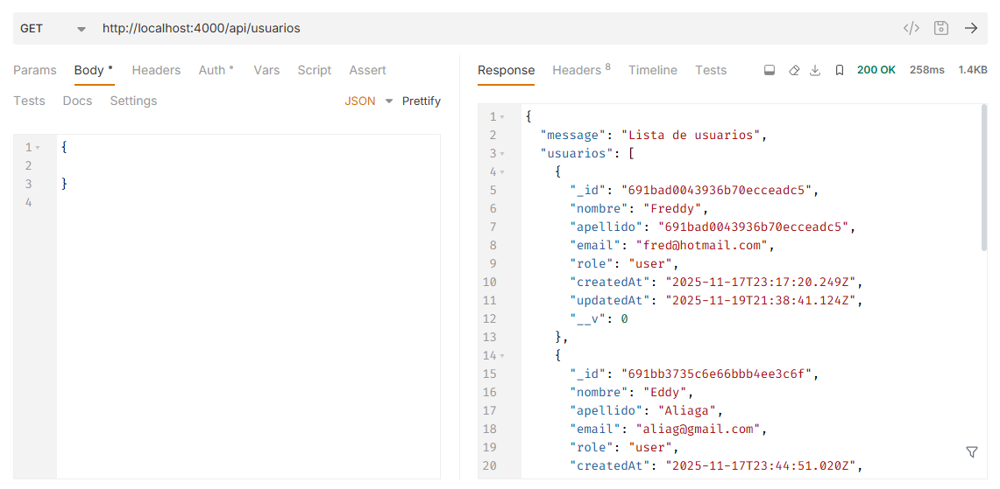
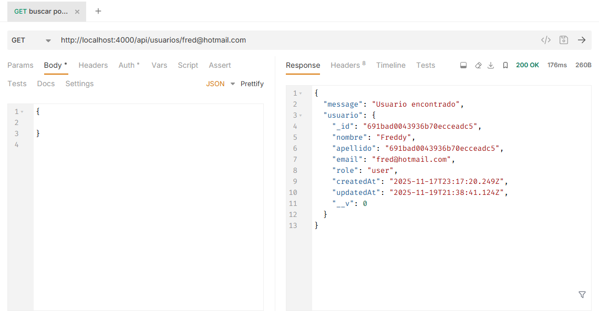
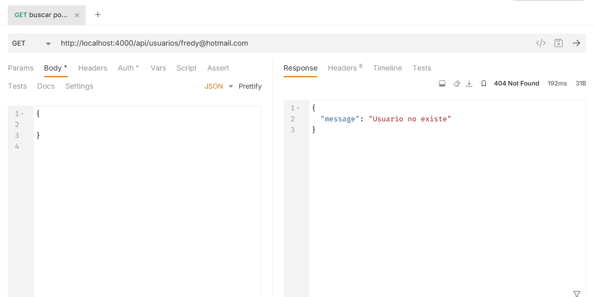
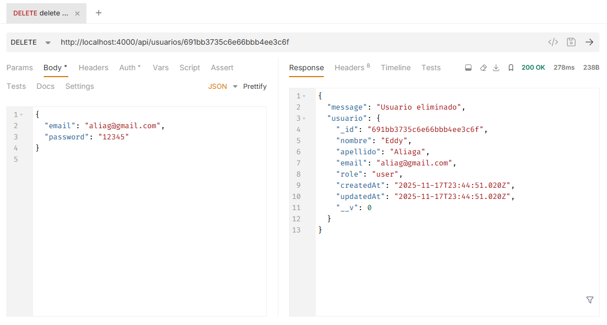
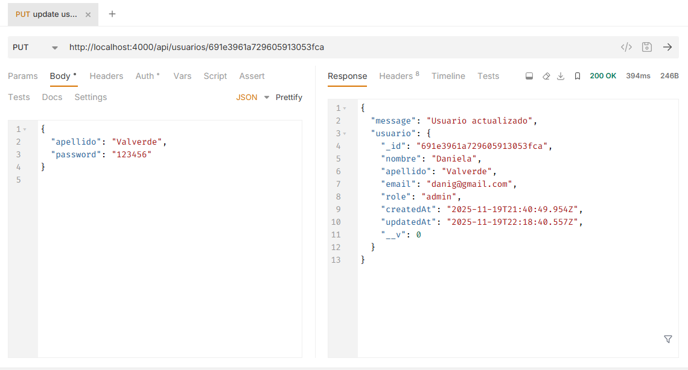
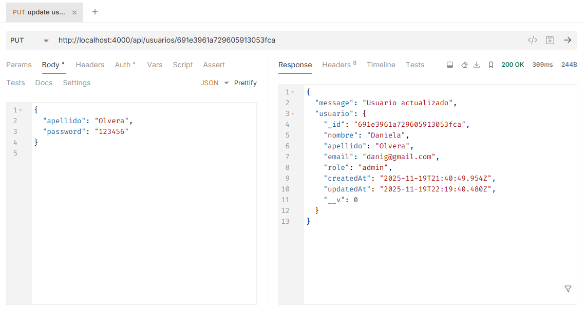
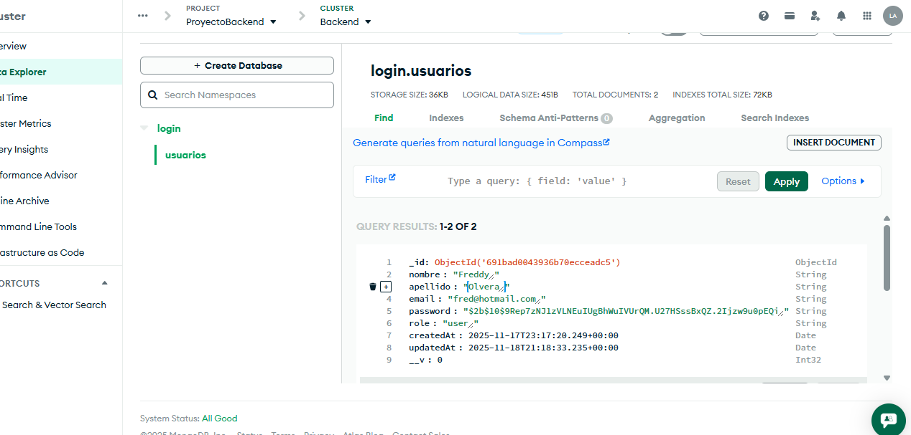

[!NOTE]
# Fullstack Backend 

Este proyecto es el **backend** de un sistema Fullstack, desarrollado con **Node.js, Express y MongoDB**.  
Su propósito es proveer una API REST para la gestión de usuarios y autenticación, lista para integrarse con un frontend.


## Propósito del backend

- Gestionar usuarios con operaciones CRUD (crear, leer, actualizar, eliminar).
- Proveer autenticación básica con email y contraseña.
- Servir como base para un proyecto fullstack (frontend + backend).
- Facilitar pruebas de API con herramienta como **Bruno**.


[!Importante]

## instalación de dependencias como :

- `express`: Framework para crear el servidor HTTP
- `mongoose`: ORM para conectar con MongoDB usando modelos y esquemas en JavaScript
- `bcryptjs`: Permite hashear contraseñas de forma segura antes de guardarlas en la base de datos
- `jsonwebtoken`: Genera y verifica tokens JWT para autenticación de usuarios en la API
- `dotenv`: Carga variables de entorno desde un archivo .env para mantener configuraciones seguras
- `cors`: Controla qué dominios pueden acceder a una API, útil para permitir peticiones desde el frontend
- `npm init -y`: Inicializa el proyecto Node.js creando automáticamente el archivo package.json
- `npm install`: Instala las dependencias listadas en package.json o las que se especifique manualmente

## Configuración de variables de entorno (`.env`)

Se debe crear un archivo llamado `.env` en la raíz del proyecto. **este archivo no debe subirse a GitHub.**

se añade las siguientes variables de ejemplo:

```ini
# Cadena de conexión al clúster de MongoDB 
MONGO_URI=mongodb+srv://<usuario_db>:<contraseña_db>@<host_cluster>/<nombre_db>?appName=Backend

# Puerto en el que se ejecutará el servidor
PORT=4000

# Una cadena de texto secreta y segura para firmar los tokens de autenticación JWT
JWT_SECRET=una_cadena_larga_y_segura_aqui_para_jwt


## archivo gitignore para no subir variables semsibles a git hub
  node_modules
  .env
  package-lock.json

## el archivo notFound sirve para cuando un usuario intenta acceder a una ruta que no existe y ahi se importa el middlewares donde estan los logger de acceso y error 404

[!Importante]

# Ejecución del Servidor
# Puede iniciar el servidor de tres maneras diferentes:

#Modo de Ejecución	        Comando	                         Descripción
Desarrollo	           npm run dev	             Inicia con nodemon para reinicio automático ante cambios.
Producción	           npm start	               Inicia el servidor principal para entorno de producción.
Manual	               node serverExpress.js	   Ejecuta el archivo principal directamente.


## arranca el servidor principal, y reinicia autoamticamente a cualquier cambio en los archivos
    npx nodemon serverExpress.js

## El servidor se levantará en:
http://localhost:4000

## rutas probadas en bruno
## el post
http://localhost:4000/api/usuarios

## cuerpo json de ejemplo:
{
  "nombre": "Luis",
  "apellido": "olvera",
  "email": "luis@test.com",
  "password": "123456"
}

## El get de usuarios:
## GET 
http://localhost:4000/api/usuarios

## get buscar usuario por email
## GET
http://localhost:4000/api/usuarios/luis@test.com

## PUT para actualizar usuario:
## PUT
http://localhost:4000/api/usuarios/<id_del_usuario>

## cuerpo json de ejemplo:
{
  "nombre": "Luis actualizado",
  "password": "nuevaclave"
}

## DELETE para eliminar usuario
## DELETE 
http://localhost:4000/api/usuarios/<id_del_usuario>

## Login
## POST
http://localhost:4000/api/login

## cuerpo json de ejemplo:

{
  "email": "luis@test.com",
  "password": "123456"
}

## un ejemplo mas claro de las rutas de prueba en bruno


---

### 4. **Endpoints disponibles**
[!NOTE]
endpoints principales:

| Método | Ruta                  | Descripción               |
|--------|-----------------------|---------------------------|
| POST   | `/api/usuarios`       | Crear nuevo usuario       |
| GET    | `/api/usuarios`       | Listar todos los usuarios |
| GET    | `/api/usuarios/:email`| Buscar usuario por email  |
| PUT    | `/api/usuarios/:id`   | Actualizar usuario        |
| DELETE | `/api/usuarios/:id`   | Eliminar usuario          |

---

[!Important]
## Pruebas de las rutas en capturas 👇

[!NOTA]
## 🖼️ Capturas de pruebas del CRUD, todas los endpoint estan protegidos con token

[!LOGIN]
### ✅ login exitoso que viene con token
[](Capturas_CRUD/Post_Login/postlogin.png)


[!POST]
### ingresar el token en el post de usuario para crear un usuario protegido
[](Capturas_CRUD/Post_Usuarios/postusuarioinsertartoken.png)

### ✅ Post exitoso 
[](Capturas_CRUD/Post_Usuarios/postusuario.png)

## probar ruta incorrecta al hacer post
[](Capturas_CRUD/Post_Usuarios/ejemplorutaincorrecta_post.png)

### ❌ Error por credenciales inválidas en el Post usuarios


[!GET TODOS LOS USUARIOS]
### 📄 Listado de usuarios - mostrar todos los usuarios



[!GET USUARIO POR EMAIL]
### 📄 Buscar usuario por email - usuario encontrado


### ❌ error al buscar el usuario por email - error (usuario no existe)



[!DELETE]
### 🗑️ Eliminar usuario - éxito



[!UPDATE USUARIO]
### ✏️ Actualizar usuario - éxito




[!ESTRUCTURA DEL PROYECTO]

proyecto-backend/
│
├── config/
│   └── BaseDatos.js        # Conexión a MongoDB
│
├── controlador/
│   └── usuarioController.js # Lógica de usuarios
│
├── middlewares/
│   ├── middlewares.js     # Manejo de errores con logger
│   └── notFound.js         # Rutas no encontradas
│
├── models/
│   └── Usuario.js          # Modelo de usuario en Mongoose
│
├── serverExpress.js        # Configuración principal del servidor
├── .env                    # Variables de entorno (ignorado en Git)
├── .gitignore              # Ignora node_modules y .env
└── package.json


[!ESTRUCTURA DE LA BAASE DE DATOS MongoDB]




[!Enlace del repositorio Git Hub]

https://github.com/LOLV25/backend-fullstack.git